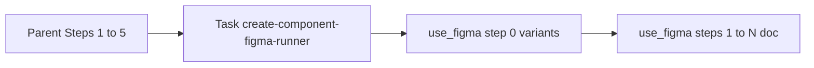

# Cursor + Composer-class hosts — `use_figma` reliability (Step 6)

**Audience:** Agents and humans using **Cursor** with **Composer-class** (or other short-output) models for [`/create-component`](../SKILL.md). **Not** a second copy of assembly rules — those stay in [`../EXECUTOR.md`](../EXECUTOR.md) and [`../../../AGENTS.md`](../../../AGENTS.md).

**Goal:** Reliable **Step 6** (Figma MCP `use_figma` with ~40–43K inline `code`) by **adoption** of the repo’s intended pipeline — not by requiring one model to emit the full minified engine in the parent thread.

**Non-goals:** Do not block on Cursor raising per-tool-arg limits; do not require “Composer-only” success for Step 6. Success = a **known-good path** (delegation + preflight) with **documented fallbacks**.

---

## Sequential work vs one `use_figma` payload (clarify the “blob”)

**Two different levels:**

1. **Orchestration (session / chat)** — **Do** break work up **sequentially**: finish each **style-guide** `canvas-bundle-runner` `Task` on its own; run **`create-component-figma-runner` once per component**; avoid one parent turn that chains unrelated large Figma calls. Tables, bundles, and component draws are **different jobs** — schedule them as **separate** steps. The parent should only pass a small **`configBlock`** + paths into the component runner, not re-assemble the minified engine in chat.

2. **Shipped component draw (Step 6 engine)** — On canvas, sections still appear in dependency order (Properties table, header, live ComponentSet tile, matrix, usage — see [`04-doc-pipeline-contract.md`](./04-doc-pipeline-contract.md)). **Target MCP transport:** **several** `use_figma` calls with **small, different** payloads — e.g. table skeleton + headers, then doc header, then component section, then Variants × States, then Do/Don’t — each call carrying only the code needed for that slice; see [`09-mcp-multi-step-doc-pipeline.md`](./09-mcp-multi-step-doc-pipeline.md) and runner [**§1c**](../../create-component-figma-runner/SKILL.md). **Interim:** the runner may still use **two** calls (**§1b**: ComponentSet build, then doc tail with injected ids) or one legacy full script (`twoPhaseDraw: false`). **Anti-pattern:** uploading the **same** full engine blob on every call when the goal is small, fast steps.

**Anti-pattern:** Parent agents writing `/tmp/*.json`, shell-piping, or re-reading giant strings to “transport” the engine — that bypasses the runner and repeats a known failure mode. If `Task` aborts, **retry the runner** or use the documented **inline** fallback per [`../EXECUTOR.md`](../EXECUTOR.md). Follow the runner’s **§1b / §1c** chunking — do not splice or trim minified engines ad hoc outside the build pipeline.

---

## ROI order (check in this sequence)

1. **Environment preflight** (below) — minutes; fixes false “MCP broken” when paths or server id are wrong.
2. **Session choreography** — finish style-guide canvas `Task`s before component draws; one component per wave when limits bite.
3. **`Task` → [`create-component-figma-runner`](../../create-component-figma-runner/SKILL.md)** — default Step 6 when subagents exist; parent never inlines the ~32–35K engine.
4. **Escalation** — model hop for the Figma call only, or parent inline per [`../EXECUTOR.md`](../EXECUTOR.md) when `Task` is unavailable.

Phased draws are **on by default** on the runner; for **timeout / execution-size** issues, confirm both phases complete before considering custom bundle surgery — see [`../../create-design-system/conventions/16-mcp-use-figma-workflow.md`](../../create-design-system/conventions/16-mcp-use-figma-workflow.md) (50k cap on each `code` string).

---

## Phase 1 — Cursor preflight (copyable checklist)

Before drawing, confirm **all** of the following:

- [ ] **DesignOps plugin root is a workspace folder** — `File → Add Folder to Workspace…` so `skills/create-component/...` resolves. See [`.cursor/rules/cursor-designops-skill-root.mdc`](../../../.cursor/rules/cursor-designops-skill-root.mdc).
- [ ] **Figma MCP `serverIdentifier`** — read workspace `mcps/**/SERVER_METADATA.json` (or Cursor’s MCP panel); the bare name `figma` may **not** work. See troubleshooting in [`16-mcp-use-figma-workflow.md`](../../create-design-system/conventions/16-mcp-use-figma-workflow.md).
- [ ] **Target file** — Figma file open; `fileKey` known (URL, handoff, or `--file-key` per [`../SKILL.md`](../SKILL.md)).

---

## Phase 2 — Default workflow: `Task` + runner

1. Parent completes Steps **1–5** and **4.7**; finalizes **`configBlock`** (verbatim `const CONFIG = { … };`, not `JSON.stringify` — functions like `applyStateOverride` must survive) and **`layout`**.

2. **One `Task` per component** with subagent type that loads [`create-component-figma-runner`](../../create-component-figma-runner/SKILL.md): pass `fileKey`, `layout`, `configBlock`, `createComponentRoot` (path to `skills/create-component/`), and `registry` per runner **§0** (omit `twoPhaseDraw` for the default **two** phased `use_figma` calls).

3. Subagent: `Read` preamble + the **appropriate** min bundle(s) per runner **§1b** / **§1c** (interim: often two calls; target: one bundle per doc step), run [`scripts/check-payload.mjs`](../../../scripts/check-payload.mjs) (and full-wrapper check if `check-use-figma-mcp-args` is used), then **`use_figma`** once per orchestrated step. Parent runs [`SKILL.md` §9](../SKILL.md) on the **final** step’s compact return + registry.

**If `Task` is missing, flaky, or times out in your Cursor build** — use Phase 3 fallbacks; do not assume the runner is unavailable “only when misconfigured.”

---

## Phase 3 — Session choreography and fallbacks

- **Tables then components** — If the same session includes **style-guide** Step 15a–c + 17 **and** `/create-component`, **finish** all canvas [`canvas-bundle-runner`](../../canvas-bundle-runner/SKILL.md) `Task`s **first**; then run components. **Do not** interleave a full table `use_figma` and a full component `use_figma` in **one** parent turn ([`AGENTS.md`](../../../AGENTS.md) *Session runbook*).
- **One component per wave** — Prefer install → 4.7 → one runner `Task` (or one inline assembly) → **two** phased `use_figma` by default → §9 + registry before starting the next component in a **new** turn if output limits bite ([`../EXECUTOR.md`](../EXECUTOR.md) *Session / output limits*).
- **Model hop (Step 6 only)** — If transport still fails after preflight + runner, run **only the Figma step** with a model that tolerates long tool args (e.g. Claude in Cursor). Policy-neutral workaround.
- **Parent inline** — When `Task` is unavailable, follow [`../EXECUTOR.md`](../EXECUTOR.md) inline assembly order with the **same** `configBlock` / `layout` already prepared (no re-derive).

---

## Symptom → likely cause

| Symptom | Likely cause | See |
|--------|----------------|-----|
| `Read` fails on `skills/create-component/...` | Plugin root not in workspace | Preflight; [`cursor-designops-skill-root.mdc`](../../../.cursor/rules/cursor-designops-skill-root.mdc) |
| `MCP server does not exist` / wrong tool target | Wrong `serverIdentifier` | `mcps/**/SERVER_METADATA.json`; [`16` troubleshooting](../../create-design-system/conventions/16-mcp-use-figma-workflow.md) |
| `Unexpected end of JSON input` on tool call | Truncated or invalid **wrapper** JSON for large `code` — not always a Figma bug | [`AGENTS.md`](../../../AGENTS.md) *MCP transport (Composer-class)*; [`../EXECUTOR.md`](../EXECUTOR.md) *Short-context* |
| `ReferenceError: PLACEHOLDER` inside Figma | Tool call structured before full `code` was pasted (stub `code`) | [Runner §2](../../create-component-figma-runner/SKILL.md) — hard prohibitions; never call with placeholders |
| Broken script after shell `cat` / long terminal dump | **Capped** stdout — silent truncation | [`16` § Troubleshooting](../../create-design-system/conventions/16-mcp-use-figma-workflow.md) — use editor `Read`, not `cat` |
| `check-payload` passes, MCP still fails | Pass validates JS string; **entire** MCP args must JSON round-trip | [`AGENTS.md`](../../../AGENTS.md); `npm run check-use-figma-args` if available |

---

## Team validation (record per environment)

Use this to confirm **Phase 2** in your **Cursor** build and to compare before/after preflight (optional ROI note).

| Field | Value |
|--------|--------|
| Date | |
| Cursor version (About) | |
| Figma MCP `serverIdentifier` used | |
| `Task` → `create-component-figma-runner` completed successfully (y/n) | |
| If n — fallback used (model hop / parent inline) | |
| Notes | |

---

## Optional measurement (lightweight ROI)

- **Qualitative:** Track Step 6 failures **before** vs **after** adopting preflight + `Task`-first + split sessions in a sprint.
- **Deeper (if needed):** Tag whether failures were **environment** (A), **transport/truncation** (B), or **model edited bytes** (C) using the table above.

---

## Authority links (do not duplicate)

| Topic | File |
|--------|------|
| Assembly order, 50k cap, short-context, inline fallback | [`../EXECUTOR.md`](../EXECUTOR.md) |
| Inline MCP, session runbook, Composer-class transport | [`../../../AGENTS.md`](../../../AGENTS.md) |
| `use_figma` workflow, cap, split calls, Cursor source root | [`16-mcp-use-figma-workflow.md`](../../create-design-system/conventions/16-mcp-use-figma-workflow.md) |
| Runner contract, `configBlock`, prohibitions | [`../../create-component-figma-runner/SKILL.md`](../../create-component-figma-runner/SKILL.md) |
