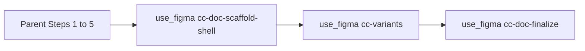

# Cursor + Composer-class hosts — `use_figma` reliability (Step 6)

**Audience:** Agents and humans using **Cursor** with **Composer-class** (or other short-output) models for [`/create-component`](../SKILL.md). **Not** a second copy of assembly rules — those stay in [`../EXECUTOR.md`](../EXECUTOR.md) and [`../../../AGENTS.md`](../../../AGENTS.md).

**Goal:** Reliable **Step 6** (Figma MCP `use_figma` with one inline `code` per slice, typically ~26–43K per call depending on step) by **adoption** of the repo’s assembly order — in the **parent** (or a design-repo script) by default, **not** by punting **~26–30K+** `code` to a **subagent** that must **emit** the full `call_mcp` JSON in one turn (that often **fails** on subagent / tool-arg limits).

**Non-goals:** Do not require “subagent or bust” for Step 6. Success = **parent** (or preassembled on disk) + `check-payload` + `use_figma` per [`../EXECUTOR.md`](../EXECUTOR.md) **§0**.

---

## Sequential work vs one `use_figma` payload (clarify the “blob”)

**Two different levels:**

1. **Orchestration (session / chat)** — **Do** break work up **sequentially**: finish each **style-guide** `canvas-bundle-runner` `Task` (or parent fallback) on its own; for **`/create-component`**, run **10** `use_figma` invocations in **order** (parent default) or optional `Task` per slice **only** if the subagent can pass full `code` — see [`13`](13-component-draw-orchestrator.md). Avoid one parent turn that chains unrelated large Figma calls. The parent assembles each slice from **`configBlock`** + `handoff` + min engine per slice-runner **§0.1**; **not** a second subagent when the first cannot carry the payload.

2. **Shipped component draw (Step 6 engine)** — On canvas, sections still appear in dependency order (Properties table, header, live ComponentSet tile, matrix, usage — see [`04-doc-pipeline-contract.md`](./04-doc-pipeline-contract.md)). **Default transport:** **10** `use_figma` calls in the **parent**, each with one slice from [`create-component-figma-slice-runner` §2](../../create-component-figma-slice-runner/SKILL.md) — see [`09-mcp-multi-step-doc-pipeline.md`](./09-mcp-multi-step-doc-pipeline.md) and [§13](13-component-draw-orchestrator.md). **Phased two-call inline** in parent remains in [`../EXECUTOR.md`](../EXECUTOR.md) **§0** (fewer round trips). **Anti-pattern:** defaulting to **`Task` → slice runner** for slices the subagent **cannot** emit. **Anti-pattern:** uploading the **same** full engine blob on every call when the goal is small, fast steps.

**Anti-pattern (still true):** Ad-hoc **minification**, **trimming** built bundles, or **stub** `code` (`PLACEHOLDER`) to “fit” MCP — that breaks `check-payload` / Figma; see [`../EXECUTOR.md`](../EXECUTOR.md) and slice runner prohibitions.

**Anti-pattern — sandbox-API absence is a tell, not a problem to solve.** The Figma plugin sandbox does not expose `fetch`, `XMLHttpRequest`, `atob`, `TextDecoder`, or `DecompressionStream`. Some agents discover this and respond by **inventing a base64 / custom-UTF-8 / `new AsyncFunction(code)()` wrapper** so they can "load" the slice into the sandbox. **The wrapper is unnecessary.** The assembled slice (CONFIG + varGlobals + preamble + min engine) **is** the plugin code — `use_figma`'s `code` argument is executed directly by the host. There is nothing to fetch, decode, or eval. If you catch yourself debugging your wrapper (regex typos, charset mismatches, async-wrapping rules, base64 padding) you have spiraled — delete the wrapper and pass the assembled bytes verbatim. The previous session that triggered this guardrail spent its full budget on a `/s/g` vs `/\s/g` regex bug inside a wrapper that should not have existed. **Trigger words to stop on:** "fetch is not defined", "atob is not defined", "TextDecoder is not defined", "Invalid or unexpected token" while decoding. Re-read [`../EXECUTOR.md`](../EXECUTOR.md) **§0** and [§Gzip / base64 / `fetch` / `AsyncFunction` wrappers] before writing any decode/runtime-load helper.

**Parent preassembles (default on short-output hosts):** The **parent** (or a script in the design repo) assembles CONFIG + preamble + `*.stepN.min.figma.js` to paths or in-thread, runs **`check-payload`**, then **`use_figma` in the parent** — [`../EXECUTOR.md`](../EXECUTOR.md) **§0** / **§0.1**. Do not splice or trim minified engines ad hoc outside the build pipeline. **Do not** use a `Task` subagent as a **crutch** for payloads the subagent cannot `call_mcp` with.

If an optional `Task` slice **aborts** on transport, **do not** loop on `Task` — use **parent-preassembled** or **inline** per [`../EXECUTOR.md`](../EXECUTOR.md); do not invent a second `Task` skill for the same draw.

---

## Context budget — subagents that hand off **files**, not megabytes of text

**Transport invariant (unchanged):** The **parent thread** is the only layer that should invoke **`use_figma`** (MCP) for Step 6 — per [`../EXECUTOR.md`](../EXECUTOR.md) **§0**. The patterns below are **context / orchestration** optimizations only. They do **not** add a second path where a subagent calls `use_figma`.

**Goal:** Finish all 10 `use_figma` calls **without** stuffing the parent thread with **every** min engine + preamble + config at once, and without duplicating large blobs in chat prose.

**Hard limit today:** Figma `use_figma` still needs **inline `code`** in the tool call — there is no `codePath` in the shipping schema. So **one** slice still costs **one** large string in the turn that calls MCP (parent `Read` → `call_mcp` or equivalent). The wins below are about **not carrying more than one slice worth of source at a time** and **keeping handoff state tiny**.

### A — **Writer (subagent or Shell) → file → parent `Read` → parent `use_figma` only**

1. An **optional** **subagent** (or a **non-interactive** `node …/assemble-create-component-slice.mjs` in the design repo) does **not** paste assembled `code` in a chat message. It **only**:
   - Runs **`check-payload`** on the assembled string (stdin or temp file).
   - **Writes** the assembled `code` to a **known path** in the **design repo** (e.g. `mcp-exports/slice-<step>.code.js` or a single `mcp-call.json` line with `fileKey` + `code` + `description` + `skillNames`) — same bytes as [`../create-component-figma-slice-runner` §0.1](../create-component-figma-slice-runner/SKILL.md), or runs `node scripts/assemble-create-component-slice.mjs <step> handoff.json out.js` if the repo has that script.
   - Returns **only** a compact object, e.g. `{ ok, step, assembledPath, checkPayloadOk, codeCharCount }` — **under ~500 characters** of JSON, no `code` field.

2. **Parent** in **one** turn: `Read` **only** `assembledPath` (or the one JSON file) → **`use_figma` (parent only)** → merge the Figma return into **`handoff.json` on disk** — preferably with [`scripts/merge-create-component-handoff.mjs`](../../../scripts/merge-create-component-handoff.mjs) so the model does not paraphrase large JSON:  
   `node scripts/merge-create-component-handoff.mjs <step> mcp-exports/handoff.json mcp-exports/last-figma-return.json`  
   (update `afterVariants` / `doc` per [13 §4](../13-component-draw-orchestrator.md)), not a long recap in chat.

3. **Repeat** for the next slug. The parent **never** holds **10** full `code` bodies in the message history at once — only the **current** `Read` result for the MCP call, plus a small **handoff** file.

### B — **Handoff outside the chat window**

- Keep **`handoff.json`** (or equivalent) as a **file** in the design repo; use **[`scripts/merge-create-component-handoff.mjs`](../../../scripts/merge-create-component-handoff.mjs)** after each parent `use_figma` to merge the return file into `handoff.json` (reduces free-form model edits to JSON).
- In the parent, **reference** “updated `mcp-exports/handoff.json` per last return” instead of re-quoting full Figma payloads in prose.

### C — **One slice per parent “wave”**

- Prefer **10 short parent turns** (or compact-and-continue) over **one** parent message that `Read`s all templates and all doc steps for planning. Do **not** `Read` [`SKILL.md`](../SKILL.md) in full in the same turn as a 30K engine `Read`.

### D — **Fresh subagent per slice (assembly writers only, never MCP)**

- If each `Task` is a **new** isolated subagent whose job is **only** “assemble + `check-payload` + **write** output file + return short path metadata,” the **subagent** context is reset each time. **That subagent still does not call `use_figma`**. The **parent** runs the next `Read` + `use_figma` + handoff merge.

### D.1 — **Writer subagent vs runner subagent (normative)**

These names describe **who calls `use_figma`**, not which file is assembled.

> 🚨 **Runner subagent is forbidden by default.** Multiple runs failed because the agent invented a parent transport limit and dropped to a `Task` runner without measuring. Read the anti-confabulation callout in [`../EXECUTOR.md`](../EXECUTOR.md) §0 first. If you genuinely doubt parent transport at the size you need, prove it with [`scripts/probe-parent-transport.mjs`](../../../scripts/probe-parent-transport.mjs) BEFORE delegating. After one successful probe, "parent can't carry X" for X ≤ `maxProvenSize` is a process failure — escalate to the user instead.

| Role | Who | Allowed | Forbidden |
|------|-----|---------|-----------|
| **Writer** | Subagent or Shell | Run `node …/scripts/assemble-slice.mjs` (default: `generate-ops` path; add `--legacy-bundles` to read `*.min.figma.js` only), pipe to `check-payload`, **write** `slice-<slug>.js` and/or `mcp-<slug>.json` (from `--emit-mcp-args`) under the **design repo**; return **only** `{ ok, step, assembledPath, checkPayloadOk, codeCharCount }` (no `code` in chat). | Calling `use_figma` / `call_mcp` in the writer (the **parent** owns MCP). |
| **Runner** | Parent thread, **always** | The parent `Read`s the assembled file and calls `use_figma` / `call_mcp` itself, with the full `code` inline. | A `Task` subagent that calls `use_figma` / `call_mcp`. Period. There is no longer a "runner subagent" role — the term exists only so you recognize the anti-pattern when you read it elsewhere. |

**Process for each slice:**

1. (optional) Writer subagent: assemble + check-payload + write `mcp-<slug>.json` to disk; return `{ outPath, step }`.
2. **Parent**: `Read` `mcp-<slug>.json`, then `call_mcp use_figma` with `{ fileKey, code, description, skillNames }` from the file.
3. **Parent**: `node scripts/finalize-slice.mjs <slug> handoff.json` (write return + merge atomically — see [`13` §5.2](13-component-draw-orchestrator.md)).

**If you find yourself reaching for `Task` to call MCP**, stop. Run `node scripts/probe-parent-transport.mjs --size <bytes>` first. The parent's measured ceiling is well above any single create-component slice.

**One slice per `Task` if you use a writer:** never batch **multiple** machine slugs (`cc-doc-props` … `cc-doc-finalize`) in a **single** `Task` prompt — you lose per-step Figma returns and on-disk merge auditability. See [§13 §5.1](13-component-draw-orchestrator.md).

### E — **What this does *not* fix (honest bound)**

- The **turn** that calls `use_figma` still needs the **inline `code` string** in the MCP request — that is O(slice size) for that turn. If the product counts tool-input tokens against the same window, **shorter** sessions, **new chat** between components, or a **higher-capacity** model for the Figma step only are still the escape hatches (already noted as “model hop” in this file and [`../EXECUTOR.md`](../EXECUTOR.md)).

### F — **Canvas (same idea)**

- When `Task` → [`canvas-bundle-runner`](../../canvas-bundle-runner/SKILL.md) works, the parent only sees a **~200 char** summary — best case for context.
- If you must **fall back** to parent `Read` of `.min.mcp.js`, do **one** bundle per turn; do not load 15a + 15b + 15c in one `Read` batch into the parent message for “analysis.”

---

## Task subagent failures — two different size limits

The Figma schema allows **`code` up to 50,000 characters** per call ([`16-mcp-use-figma-workflow.md`](../../create-design-system/conventions/16-mcp-use-figma-workflow.md)). That is **not** the only limit in play:

1. **Subagent / host MCP envelope** — Some Cursor (or `Task`) paths serialize the **entire** `use_figma` tool arguments as JSON. A real run failed at **~28.8K JSON** for a single call when using **§1b** two-phase with the **full** per-archetype bundle + CONFIG + preamble (~**44–45K** `code` for `control`, ~**40–42K** for `chip`). The failure mode is *host-side* truncation or rejection, not Figma’s 50K string cap.

2. **§1d step-0** is smaller (~**18K** minified engine for `control` + ~**6K** preamble + CONFIG) but **control + step0** can still land near **~26–29K** total `code` — close enough to (1) that **parent** assembly + `use_figma` in the **parent** (or preassembled files) is the **reliable** handoff — not a **subagent** that must re-emit the same string in `call_mcp`.

3. **Never** use **`PLACEHOLDER`** in `code` to probe tool wiring — Figma throws `ReferenceError`; use a **tiny** real script (`return { ok: true, fileKey: figma.fileKey };`) for connectivity checks.

4. **Subagent `stdout` caps** — Using **`cat` / `echo` / shell** to dump a min bundle as proof can **truncate** (~20K in some runs). Use editor **`Read` on a file path** (or a short `wc -c`) for diagnostics, per [`16` troubleshooting](../../create-design-system/conventions/16-mcp-use-figma-workflow.md).

**Recovery order (same component):** **parent** `use_figma` per slice (default) with assembly per [`../create-component-figma-slice-runner`](../create-component-figma-slice-runner/SKILL.md) — **or** preassembled on disk (writer subagent/Shell) if easier. **MCP** stays on the **parent** unless you deliberately use the rare optional path where a subagent can emit full `call_mcp` (see [`../EXECUTOR.md`](../EXECUTOR.md) item 4). If tool args still fail: model hop (longer context for the **parent** Figma call only).

### G — Large-payload transport research (2026) — not a second transport

- **@file in chat vs. tool args:** Attaching a file in Cursor chat is **not** the same as Figma’s inline `code` string. The official Figma `use_figma` schema has no `codeWorkspacePath`. Do not assume `@path` indirection in tool parameters until a host documents it — see [`docs/research/mcp-large-payload-transport-2026.md`](../../../docs/research/mcp-large-payload-transport-2026.md).
- **Fallbacks** (validate → parent `Read` → probe → model hop) — [`docs/mcp-transport-cursor-fallback.md`](../../../docs/mcp-transport-cursor-fallback.md).
- **Gzip + base64** in the plugin VM remains out of default assembly unless [`AGENTS.md`](../../../AGENTS.md) and measured plugin behavior say otherwise; this file’s *Anti-pattern — sandbox* paragraph stays normative for slice assembly.

---

## ROI order (check in this sequence)

1. **Environment preflight** (below) — minutes; fixes false “MCP broken” when paths or server id are wrong.
2. **Session choreography** — finish style-guide canvas `Task`s before component draws; one component per wave when limits bite.
3. **Parent** `use_figma` for each slice (spec: [`create-component-figma-slice-runner`](../../create-component-figma-slice-runner/SKILL.md); DAG: [`§13`](../13-component-draw-orchestrator.md)) — **default**; **context optimization** = §0.0 in [`../EXECUTOR.md`](../EXECUTOR.md) and *Context budget* above. On transport failure, **preassembled / writer** per [`../EXECUTOR.md`](../EXECUTOR.md) **§0** (parent still issues `use_figma`). The rare `Task` that calls MCP is **not** the optimization path.
4. **Escalation** — model hop for the Figma call only, or longer-context parent per [`../EXECUTOR.md`](../EXECUTOR.md).

The **slice** path uses **10** smaller payloads than a single monolith. For **timeout / execution-size** issues, see [`../../create-design-system/conventions/16-mcp-use-figma-workflow.md`](../../create-design-system/conventions/16-mcp-use-figma-workflow.md) (50k cap on each `code` string).

---

## Phase 1 — Cursor preflight (copyable checklist)

Before drawing, confirm **all** of the following:

- [ ] **DesignOps plugin root is a workspace folder** — `File → Add Folder to Workspace…` so `skills/create-component/...` resolves. See [`.cursor/rules/cursor-designops-skill-root.mdc`](../../../.cursor/rules/cursor-designops-skill-root.mdc).
- [ ] **Figma MCP `serverIdentifier`** — read workspace `mcps/**/SERVER_METADATA.json` (or Cursor’s MCP panel); the bare name `figma` may **not** work. See troubleshooting in [`16-mcp-use-figma-workflow.md`](../../create-design-system/conventions/16-mcp-use-figma-workflow.md).
- [ ] **Target file** — Figma file open; `fileKey` known (URL, handoff, or `--file-key` per [`../SKILL.md`](../SKILL.md)).

---

## Phase 2 — Default workflow: parent `use_figma` + slice spec

1. Parent completes Steps **1–5** and **4.7**; finalizes **`configBlock`** (verbatim `const CONFIG = { … };`, not `JSON.stringify` — functions like `applyStateOverride` must survive) and **`layout`**.

2. **Default — 10 `use_figma` invocations in the parent**, each assembled per [`create-component-figma-slice-runner` §0.1 / §2](../../create-component-figma-slice-runner/SKILL.md): `step` (`cc-doc-scaffold-shell` → … → `cc-doc-finalize`), `fileKey`, `layout`, `configBlock`, `createComponentRoot`, `registry`, and `handoffJson` per [slice runner **§0**](../../create-component-figma-slice-runner/SKILL.md) and [orchestrator **§4**](../13-component-draw-orchestrator.md). Run [`scripts/check-payload.mjs`](../../../scripts/check-payload.mjs) before each submit. Parent runs [`SKILL.md` §9](../SKILL.md) on the **last** slice’s return + registry.

3. **Optional** — `Task` → slice runner **per slug** when the subagent is **proven** to pass full `call_mcp` for that slice. **If not**, stay in the parent; do not retry failed `Task` for transport.

**If** parent or `Task` is flaky — use Phase 3 fallbacks ([`../EXECUTOR.md`](../EXECUTOR.md) preassembled on disk, phased full-engine, model hop for tool-arg size only).



*(Ten sequential `use_figma` calls in production; diagram shows first and last for brevity.)*

---

## Phase 3 — Session choreography and fallbacks

- **Tables then components** — If the same session includes **style-guide** Step 15a–c + 17 **and** `/create-component`, **finish** all canvas [`canvas-bundle-runner`](../../canvas-bundle-runner/SKILL.md) `Task`s **first**; then run components. **Do not** interleave a full table `use_figma` and a full component `use_figma` in **one** parent turn ([`AGENTS.md`](../../../AGENTS.md) *Session runbook*).
- **One component per wave** — Prefer install → 4.7 → **10** parent `use_figma` slices (or **`EXECUTOR`** phasing) → §9 + registry; new turn if limits bite ([`../EXECUTOR.md`](../EXECUTOR.md) *Session / output limits*).
- **Model hop (Step 6 only)** — If transport still fails after preflight + parent assembly (or **EXECUTOR** preassembled on disk), run **only the Figma step** with a model that tolerates long tool args (e.g. Claude in Cursor). Policy-neutral workaround.
- **Parent / preassembled** — When subagent or inline chat fails, follow [`../EXECUTOR.md`](../EXECUTOR.md) (same `configBlock` / `layout` — no re-derive).

---

## Symptom → likely cause

| Symptom | Likely cause | See |
|--------|----------------|-----|
| `Read` fails on `skills/create-component/...` | Plugin root not in workspace | Preflight; [`cursor-designops-skill-root.mdc`](../../../.cursor/rules/cursor-designops-skill-root.mdc) |
| `MCP server does not exist` / wrong tool target | Wrong `serverIdentifier` | `mcps/**/SERVER_METADATA.json`; [`16` troubleshooting](../../create-design-system/conventions/16-mcp-use-figma-workflow.md) |
| `Unexpected end of JSON input` on tool call | Truncated or invalid **wrapper** JSON for large `code` — not always a Figma bug | [`AGENTS.md`](../../../AGENTS.md) *MCP transport (Composer-class)*; [`../EXECUTOR.md`](../EXECUTOR.md) *Short-context* |
| `ReferenceError: PLACEHOLDER` inside Figma | Tool call structured before full `code` was pasted (stub `code`) | [`EXECUTOR.md`](../EXECUTOR.md) — never call with placeholders; run `check-payload` first |
| Broken script after shell `cat` / long terminal dump | **Capped** stdout — silent truncation | [`16` § Troubleshooting](../../create-design-system/conventions/16-mcp-use-figma-workflow.md) — use editor `Read`, not `cat` |
| `check-payload` passes, MCP still fails | Pass validates JS string; **entire** MCP args must JSON round-trip | [`AGENTS.md`](../../../AGENTS.md); `npm run check-use-figma-args` if available |

---

## Team validation (record per environment)

Use this to confirm **Phase 2** in your **Cursor** build and to compare before/after preflight (optional ROI note).

| Field | Value |
|--------|--------|
| Date | |
| Cursor version (About) | |
| Figma MCP `serverIdentifier` used | |
| Parent 10-slice `use_figma` (or `Task` if proven) completed successfully (y/n) | |
| If n — fallback used (model hop / parent inline) | |
| Notes | |

---

## Optional — design-repo “assemble only” helper (no `use_figma` in script)

**Goal:** one npm script in the **consumer design repo** that shells to this plugin’s `assemble-slice.mjs` with fixed paths — **assembly and `--emit-mcp-args` only**; the **parent** still `Read`s the emitted JSON and issues **`call_mcp`**. Reduces copy-paste errors. Example `package.json` script (paths relative to that repo — adjust the plugin path):

```json
"scripts": {
  "assemble-step": "node ../DesignOps-plugin/scripts/assemble-slice.mjs --step cc-doc-props --layout chip --config-block ./mcp-exports/config-block.js --registry ./.designops-registry.json --handoff ./mcp-exports/handoff.json --file-key $FIGMA_FILE_KEY --out ./mcp-exports/slice-code.js --emit-mcp-args ./mcp-exports/mcp-cc-doc-props.json"
}
```

**Pair with:** this file **§D.1** (writer + parent `use_figma`); keep **`mcp-<step-slug>.json`** as the `--emit-mcp-args` output name. Optional: add `.mcp-*.json` to that repo’s **`.gitignore`**; keep **`slice-*.js`** if you need replay. **Not** a substitute for a host that adds `codePath` to Figma MCP (does not exist in the shipping schema).

**Sanity check:** after emitting, `node -e "JSON.parse(require('fs').readFileSync('mcp-<slug>.json','utf8'))"` should succeed before the parent builds the tool call.

## Optional measurement (lightweight ROI)

- **Qualitative:** Track Step 6 failures **before** vs **after** adopting preflight + parent-slice-default + split sessions in a sprint.
- **Deeper (if needed):** Tag whether failures were **environment** (A), **transport/truncation** (B), or **model edited bytes** (C) using the table above.

---

## Authority links (do not duplicate)

| Topic | File |
|--------|------|
| Assembly order, 50k cap, short-context, inline fallback | [`../EXECUTOR.md`](../EXECUTOR.md) |
| Inline MCP, session runbook, Composer-class transport | [`../../../AGENTS.md`](../../../AGENTS.md) |
| `use_figma` workflow, cap, split calls, Cursor source root | [`16-mcp-use-figma-workflow.md`](../../create-design-system/conventions/16-mcp-use-figma-workflow.md) |
| Slice runner + orchestrator, `configBlock` | [`../../create-component-figma-slice-runner/SKILL.md`](../../create-component-figma-slice-runner/SKILL.md), [§13](13-component-draw-orchestrator.md) |
