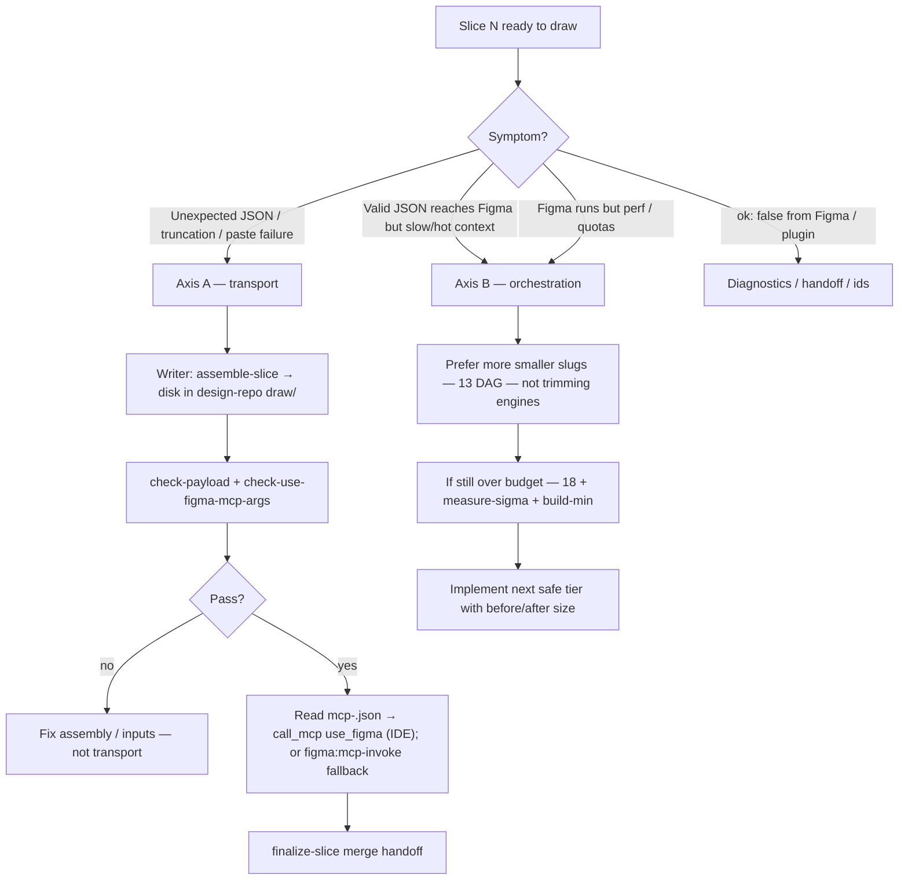

# MCP ephemeral payload protocol (normative — create-component Step 6 + related)

**Procedure order (`SLUG_ORDER`, merge, resume):** [`13-component-draw-orchestrator`](./13-component-draw-orchestrator.md).

**Audience:** Every agent invoking Figma **`use_figma`** for `/create-component` or debugging transport.  
**Companion:** [`08-cursor-composer-mcp`](./08-cursor-composer-mcp.md) **§** writer vs parent; [`18-mcp-payload-budget`](./18-mcp-payload-budget.md); [`AGENTS.md`](../../../AGENTS.md) **MCP payloads** section.

---

## Two separate problems — do not conflate them

| Axis | Question | Handles |
|------|----------|---------|
| **A — Transport** | Can this host pass **complete** MCP tool JSON **without truncation** when `code` is large? | **Default:** parent **`Read`** **`mcp-<slug>.json`** → **`call_mcp` `use_figma`** (Cursor or Claude Figma MCP). **Fallback:** **`npm run figma:mcp-invoke -- --file mcp-<slug>.json`** ([`23`](./23-designops-step6-engine.md), [`figma-mcp-invoke-from-file.mjs`](../../../scripts/figma-mcp-invoke-from-file.mjs)) **or** writer → disk → parent **`Read`** → **`call_mcp`** ([`08`](./08-cursor-composer-mcp.md) §A, §D.1); [`docs/mcp-transport-cursor-fallback.md`](../../../docs/mcp-transport-cursor-fallback.md) |
| **B — Wire size** | Is the **assembled** slice still too heavy *even after* reliable transport? | More [`18`](./18-mcp-payload-budget.md) rounds, scaffold sub-slugs, [`build-min-templates`](../../../scripts/build-min-templates.mjs) / CONFIG projection / tuple ops per **18** |

**Rule:** Fixing **B** alone does **not** fix pasted/truncated tool JSON; fixing **A** alone does **not** remove repeated CONFIG/engine bytes. Agents run **measurement** (`check-*`, probes) against the **failure class** they observe.

---

## Decision tree (per slice — follow in order)

1. **Classify:** Is the failure **`Unexpected end of JSON`** / truncated args → **Axis A**. Is the failure **size / maintainability / north-star budget** → **Axis B**.
2. **Axis A:** Use the **explicit file-backed transport** sequence below — **never** loosen validation or invent a gzip/bootstrap layer ([`08`](./08-cursor-composer-mcp.md) sandbox anti-pattern).
3. **Axis B:** Follow **`13`** scaffold + doc ladder granularity; apply **`18`** + measured baselines (`check-*`, `measure-sigma`).
4. **Confabulated parent caps:** **[`scripts/probe-parent-transport.mjs`](../../../scripts/probe-parent-transport.mjs)** once **before** changing runner strategy ([`AGENTS.md`](../../../AGENTS.md)).

---

## Ephemeral-file transport sequence (canonical — Axis A)

Use this checklist **for every slice** when the parent prefers **not** to embed `code` in chat, or when the IDE has truncated tool JSON in the past.

| Step | Who | Action |
|:---:|:---:|---|
| 1 | Agent | Resolve a **staging root** outside **`skills/`** in **this repo**: prefer **consumer design repo** (e.g. `<project>/designops-draw/<run-id>/` or existing `draw/`/`mcp-exports/`), **or** OS temp. **Never** commit scratch under **`skills/`** |
| 2 | Shell | `node scripts/assemble-slice.mjs … --out <staging>/<slug>.code.js [--emit-mcp-args <staging>/mcp-<slug>.json]` from **DesignOps-plugin** root (paths to `--config-block`, `--handoff`, `--registry` point at the consumer project as today) ([`assemble-slice.mjs` header](../../../scripts/assemble-slice.mjs)) |
| 3 | Shell | Scripts run **`check-payload`** + **`check-use-figma-mcp-args`** by default (**exit ≠ 0** → fix inputs; do **not** skip unless you documented `--skip-*` reason) |
| 4 | **Parent** (default) or **Shell** (fallback) | **Parent** **`Read`** `mcp-<slug>.json` → **`call_mcp` `use_figma`** (Cursor or Claude Code Figma MCP) → **`Write`** **`return-<slug>.json`**. **Or** **`npm run figma:mcp-invoke`** with **`FIGMA_DESKTOP_MCP_URL`** — Node reads the same file; use when IDE transport fails **[`probe-parent-transport`](../../../scripts/probe-parent-transport.mjs)** or CI has no MCP |
| 5 | **Parent** | `finalize-slice` / [`merge-create-component-handoff.mjs`](../../../scripts/merge-create-component-handoff.mjs) per **`13`** — update **`handoff.json`** on disk; do not paraphrase large returns |
| 6 | Agent | **`Delete`** staging files **after** successful merge when the designers do not need retained debug artifacts (`gitignored` dirs are fine leaving until session end) |

**Canonical names:**

- **`mcp-<step-slug>.json`** alongside `--emit-mcp-args` (e.g. `mcp-cc-doc-props-1.json` if slug includes hyphen numbering per merge script).

- **`assemble-slice` exit codes** `10`, `11`, `17`: treat as blocking — **`17`** means clean non-canonical siblings in the emit directory ([`assemble-slice.mjs`](../../../scripts/assemble-slice.mjs)).

**Still forbidden:**

- **`Task` / subagent calling `figma:mcp-invoke` / `call_mcp` / `use_figma`** except rare proof that subagent emits full MCP args (**default = manifest `Read` + `call_mcp`** or **`fallbackShellPipe`**) ([`08`](./08-cursor-composer-mcp.md) §D.1).
- **`PLACEHOLDER`** or hand-trimmed `code` to “fit.”
- **Parallel naming schemes** in the same **`--emit-mcp-args` directory** (`mcp-invoke-*.json`, etc.) — script **exit 17** exists to enforce this ([`assemble-slice`](../../../scripts/assemble-slice.mjs)).

---

## Pairing ephemeral transport with shrink roadmap (Axes A + B)

| If you … | Then … |
|---------|--------|
| Only need **reliable MCP delivery** | **§ Ephemeral-file transport sequence** alone is enough (`Read` preserves full UTF-8/length). |
| Need **smaller sustained wire size** | After transport works, run **`measure-sigma`**, **`check-use-figma-mcp-args`**, and follow **`18`** — **committed** projection maps under `scripts/` / repo, **not** ad hoc JSON strips in **`skills/`** scratch files. |
| Hit **Composer / short-output limits** while **only** shrinking bytes | Prefer **narrower scaffold sub-slugs** and **`13`** sequencing before inventing wrappers ([`memory.md`](../../../memory.md) MCP anti-spiral). |

Ephemeral paths **carry** validated bytes; **`18`** + build tooling **changes assembly** — both may apply to the **same** component over time without contradiction.

---

## Where this plugs into global policy

| Document | Relationship |
|---------|----------------|
| [**`AGENTS.md`**](../../../AGENTS.md) **MCP payloads** | Declares prefer-inline + **explicitly OK ephemeral** carries; forbids **`skills/`** persistent scratch |
| [**`08`**](./08-cursor-composer-mcp.md) | Writer ↔ parent MCP ownership, recovery order |
| [**`18`**](./18-mcp-payload-budget.md) | Byte-reduction north star **orthogonal** to file carriers |
| [`docs/mcp-transport-cursor-fallback.md`](../../../docs/mcp-transport-cursor-fallback.md) | IDE-specific fallback ladder |
| **`13`** **§** handoff / merge | Invariants unchanged when using files |

---

## Self-check before closing a draw

- [ ] Every slice passed **`check-payload`** (or recorded exit with `--skip` reason reviewed).
- [ ] **`mcp-*.json`**, if used, **`JSON.parse`**’d in tooling pass or parent without truncation symptom.
- [ ] **`handoff.json`** updated via **merge scripts**, not pasted return blobs.
- [ ] No orphaned scratch tracked under **`skills/`** **in DesignOps-plugin** for “clipboard” payloads.

