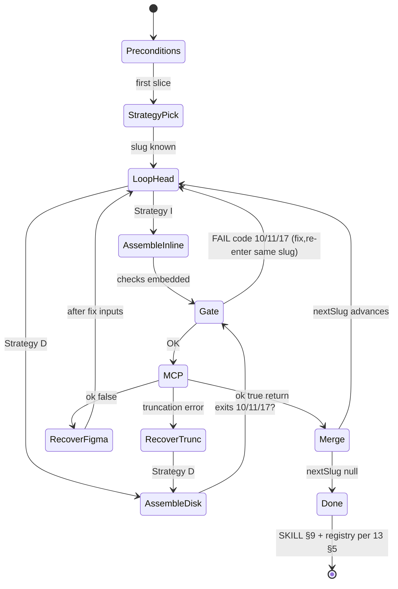

# Deterministic agent flows — Step 6 (`use_figma` ladder)

**Audience:** Agents executing **`/create-component` Step 6** end-to-end.  
**Depends on:** [`13-component-draw-orchestrator`](./13-component-draw-orchestrator.md) (DAG, handoff). **Companion:** [`21-mcp-ephemeral-payload-protocol`](./21-mcp-ephemeral-payload-protocol.md) (transport × bytes). **Scripts:** **`npm run designops:step6:status`** / **`designops:step6:prepare`** — [`23-designops-step6-engine`](./23-designops-step6-engine.md) (canonical manifest + **`parent_actions`**).

This document fixes **exact procedure order**. Agents should prefer **[`23-designops-step6-engine`](./23-designops-step6-engine.md)** (`npm run designops:step6:status` / `prepare`) for scripted **`current-step.manifest.json`** when the DesignOps-plugin repo root is available. If a step conflicts elsewhere, **`13`** + merge-script contracts win for **what** hits Figma; this file wins for **how the agent gates each hop** without the engine.

---

## 0 — Golden constraints (never skip)

| ID | Constraint |
|:---:|---|
| **G1** | **One machine slug ⇒ one successful `merge` ⇒ next slug.** Order is [`SLUG_ORDER`](../../../scripts/merge-create-component-handoff.mjs); orchestration **[`13` §1](./13-component-draw-orchestrator.md#1--fixed-dag-machine-order)**. No parallel slug runs; no reorder. |
| **G2** | **Only the parent thread** invokes **`call_mcp` → `use_figma`**. A subagent **may** assemble and **write disk** (**writer** role); **never** run MCP inside `Task**. |
| **G3** | **Validated bytes before MCP:** **`check-payload`** on `code`; if using **`--emit-mcp-args`**, **`check-use-figma-mcp-args`** (both run automatically from [`assemble-slice.mjs`](../../../scripts/assemble-slice.mjs) unless `--skip`). |
| **G4** | **Proof over fiction:** cite [`scripts/probe-parent-transport.mjs`](../../../scripts/probe-parent-transport.mjs) before claiming the parent cannot carry N bytes (**[`AGENTS.md`](../../../AGENTS.md)**); after a passing probe at N, inventing limits for ≤ N is defect. |
| **G5** | **Staging root** for ephemeral files stays **outside** DesignOps **`skills/`** tree — consumer **`draw/`** / **`mcp-exports/`** / OS temp. |

---

## 1 — State you must hold in memory (minimal)

| Piece | Meaning |
|---|---|
| **`draw-dir`** | Directory containing **`handoff.json`** (**`phase-state.json`**, **`return-<slug>.json`** siblings — **[`13` §5](./13-component-draw-orchestrator.md)**). |
| **`slug`** | From **`phase-state.json`** **`nextSlug`** when present; otherwise first **`SLUG_ORDER`** entry. Shape: [`schema/phase-state.schema.json`](./schema/phase-state.schema.json). |
| **`handoff`** | JSON on disk reflecting **prior** merges; **`handoffJson`** string/input for next **`assemble-slice`** |
| **`Strategy`** | **`I`** = inline-oriented assembly (**I‑path**); **`D`** = disk-oriented (**D‑path**) — pick at slice 1 (**§**2 — this doc), hold until recovery (**§**8). |

Agents **persist** authoritative state **on disk** (`handoff`, `phase-state`); chat prose is commentary only.

---

## 2 — Choose Strategy **I** vs **D** (once per component ladder)

```
┌─────────────────────────────────────────────────────────────────┐
│  Entering first Step 6 slice (`cc-doc-scaffold-shell`), no resume│
└─────────────────────────────────────────────────────────────────┘
                                 │
           ┌─────────────────────┴─────────────────────┐
           ▼                                             ▼
   Host already broke tool JSON                    Default / sane host
   (truncation / paste flakes) … OR                (Claude desktop, probe OK)
   Composer-class + prior slice failed on JSON
           │                                             │
           ▼                                             ▼
   Strategy **D** (disk-assisted)                       Strategy **I** (inline-heavy)
```

| Strategy | Prefer when | Forbidden |
|----------|-------------|-----------|
| **I** | Parent can **`Read`** assemblies into `call_mcp` without truncation; **`assemble-slice`** may still run via Shell — artifacts optional | Defaulting **`Task`** to call MCP |
| **D** | Any evidence of MCP wrapper truncation; scripted **`--emit-mcp-args`** needed for repeatable **`Read` → MCP** | Same-named junk JSON alongside **`mcp-<slug>.json`** (assemble-slice **exit 17**) |

**Mixed ladders:** Prefer **either** **I** or **D** for **all twelve** slices in one component draw for repeatable logs. Changing mid-ladder allowed **only on recovery** (**§**8): e.g. after **R‑TRUNC**, next slice upgrades to **D**.

---

## 3 — Flow **P — The master slice loop** (one component)

This is the **deterministic backbone**. Execute **exactly twelve** sequential slug passes (`nextSlug` advances until `null`) unless **resume** shortens remainder or **§**8 recovery aborts the ladder pending human fix.

```
P0  Preconditions ─────────────────────────────────────────────────
    • Steps 1–5 + 4.7 complete per SKILL (CONFIG, registry, fileKey)
    • `draw-dir/` exists; initial `handoff.json` `{}` OR valid resume
    • **`Read`** **`phase-state.json`** if present → `slug ← nextSlug`; else first [`SLUG_ORDER`](../../../scripts/merge-create-component-handoff.mjs) slug

P1  LOOP while phase-state indicates work (manual: 12 slug passes or resume)

    P1.1  SELECT slug ── from phase-state.nextSlug OR first incomplete per merge contract

    P1.2  MATERIALIZE assembled `code`
          IF Strategy **I** → **§**4 (**Flow I**)
          ELSE → **§**5 (**Flow D**)

    P1.3  GATE ─ exit 10/11 from assemble ⇒ STOP ladder; FIX inputs (**§**8.3)
                             exit 0 from checks     ⇒ GOTO P1.4

    P1.4  PARENT MCP (single invocation)
          `call_mcp` tool `use_figma` with { fileKey, code, description, skillNames … }
          ── Nobody else invokes MCP.

    P1.5  IF MCP response parse error / "Unexpected end of JSON"
          GOTO recovery R‑TRUNC (**§**8.1); do not advance slug

          IF Figma body ok: false GOTO R‑FIGMA (**§**8.2)

          ELSE success path:

    P1.6  ATOMIC MERGE
          Prefer: `finalize-slice` (**13** §5.2): pipe return JSON →
          node scripts/finalize-slice.mjs <slug> draw-dir/handoff.json
          (large returns: stdin file / `--return-path`; see finalize-slice header)

    P1.7  VERIFY `phase-state.nextSlug`
          Expected: next slug in DAG or null after finalize

    P1.8  INCREMENT: next iteration uses updated handoff (**G1 satisfied**)

END LOOP at `nextSlug === null` after **`cc-doc-finalize`** success

P2  Terminal — SKILL §9 + registry 5.2 on **finalize** return only (**13** §5)
```

---

## 4 — Flow **I** — Inline assembly path per slice

Use when **`Strategy === I`** (no mandatory disk carry).

| Step | Actor | Actions |
|:---:|:---:|---|
| **I1** | Shell or parent | Prefer **one**: `cd <DesignOps-plugin>` then `node scripts/assemble-slice.mjs --step <slug> --layout <layout> --config-block <consumerPath> … --registry <registry> --handoff <draw-dir/handoff.json> --file-key <FK> [--description "…"]` **without** `--out` emits to stdout pipe — capture for MCP **only if** stdout is trustworthy for your host (**some** Composer hosts: **redirect to `--out`** and treat as **`D`** for that slice to avoid truncation). |
| **I2** | Shell | `assemble-slice` runs embedded checks (**G3**) → exit nonzero stops ladder (**P1.3**) |
| **I3** | Parent | Embed captured `code` in **one** **`call_mcp`** (**P1.4**) |
| **I4** | Parent | **`finalize-slice`** merge (**P1.6**) |

**Composer guard:** If **I3** repeats **R‑TRUNC** symptoms, flip **`Strategy`** to **D** for **remaining slices** (**§**8.1).

---

## 5 — Flow **D** — Disk-assisted assembly path per slice

Use when **`Strategy === D`** or **recovery enforced disk**.

| Step | Actor | Actions |
|:---:|:---:|---|
| **D1** | Agent | **`staging`** = **`draw-dir/mcp-session/`** (or **`…/staging/`**) — sibling to `handoff.json`, **gitignored** if needed |
| **D2** | Shell | `assemble-slice` with `--out <staging>/<slug>.code.js` **and** `--emit-mcp-args <staging>/mcp-<slug>.json` (same semantics as **`21`** ephemeral table); full CLI in **`assemble-slice.mjs`** header |
| **D3** | Shell | Exit **`10`** / **`11`** / **`17`** ⇒ **STOP** (**§**8.3–8.4) |
| **D4** | Parent **`Read`** | Full **`mcp-<slug>.json`** or raw **`.code.js`** (never **`cat`**) |
| **D5** | Parent | Extract tool fields → **one** **`call_mcp`** (**P1.4**) |
| **D6** | Parent | **`finalize-slice`** (**P1.6**) |

---

## 6 — Flow **W** — Writer **`Task`** (optional per slice only)

Triggers **when** isolation from parent context outweighs scripting in parent ([**`08`**](./08-cursor-composer-mcp.md) §D).

| Step | Constraint |
|:---:|:---|
| **W1** | **Single-purpose `Task` prompt**: exact **`slug`**, paths to **`draw-dir`**, config, registry — **no** multi-slug batch ([**`13` §**5.1](./13-component-draw-orchestrator.md#51--one-machine-slug-one-figma-call-one-optional-task-never-batch-doc-legs)). |
| **W2** | Writer runs Shell **`assemble-slice`** (same flags as **§**5 **D2**) + returns ≤ ~500 chars JSON `{ assembledPath \| mcpPath, slug }` — **no** **`code`** in chat. |
| **W3** | **`Task` ends**. Parent **`Read`** → **`call_mcp`** (**§**5 **D4**–**D6** only). |

If writer cannot complete **exit 0** (**D3** failures), **`Task`** does **not** retry MCP — fix inputs and rerun **W**.

---

## 7 — Flow **C — Canvas style-guide bundles (Steps 15/17)**

**Not** the component ladder — insert here **only** to avoid accidental mixing with **§**3.

```
C1   Task.canvas-bundle-runner OR parent Read *.min.mcp.js ─ per [16] fallback
C2   One bundle per invocation; sequential slugs across session runbook (**AGENTS**)
C3   No component Step 6 MCP in **same parent turn**
```

Full matrix: **`17-table-redraw-runbook`** + **`canvas-bundle-runner`/SKILL**.

---

## 8 — Failure & recovery routing (deterministic)

| Pattern ID | Symptoms | Next action |
|:----------:|-----------|---------------|
| **R‑TRUNC** | MCP / host error suggests JSON truncated; pasted `call_mcp` implausible size | **`Strategy ← D`**; rerun **same slug** disk path (**§**5); **`probe`** once if debating limits |
| **R‑FIGMA** | Parsed response; `ok: false`; plugin/stack trace | Diagnostics in **08** §F recovery; fix **handoff** / node ids (`13` §4); **retry same slug after fix** — never skip |
| **R‑EXIT10** | `check-payload` / assemble failure | Repair CONFIG / template inputs; rerun **same slug** (**no** MCP until **exit code 0**). |
| **R‑EXIT11** | MCP wrapper validation | Fix JSON escaping pipeline; rerun assemble |
| **R‑EXIT17** | Forbidden sibling names in `--emit-mcp-args` dir | Purge offending files; rerun **D2** |
| **R‑MERGE13/14/…** | `merge-create-component-handoff` refuses order | Inspect **handoff** / returns; **`resume-handoff.mjs`** dry-run ([**`13` §**5.3](./13-component-draw-orchestrator.md#53--recovering-a-broken-ladder)). |

**Never recover by:** **`Task`** calling **`use_figma`**; **`PLACEHOLDER`** `code`; ad-hoc gz/base64 loaders (**08**, **21**).

---

## 9 — Diagram — whole machine (readable)



---

## 10 — Self-test (agent must affirm before declaring draw done)

- [ ] **Twelve** (or resumed remainder) merges — **`completedSlugs`** contiguous (**13** §5.4)?
- [ ] **`Strategy`** unchanged except documented **recovery**?
- [ ] **`finalize-slice`** (or equivalence) ran after **each** successful MCP?
- [ ] **`call_mcp` count equals** **`use_figma` count** equals **successful slug count** incremental — no ghost Task MCP?

---

## Cross-index

| Need | Doc |
|------|-----|
| Slug spellings + row ranges | **`13`** §1–2 |
| handoff globals | **`13`** §4 |
| **`merge` / finalize** semantics | **`13`** §5 |
| ephemeral policy | **`21`**, **`AGENTS`** |
| Cursor quirks | **`08`** |
